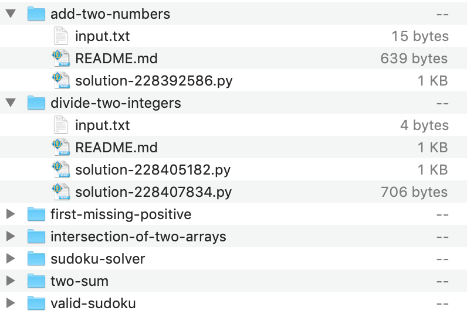

# leetcode-exporter
Quick and dirty Python script to download submitted solutions from [LeetCode](https://leetcode.com)

Script extracts your solutions in batches of 20 throttled at 1 second and saves them into `./leetcode-solutions` directory.

In order to authenticate the script, log into your account in browser, copy the value of `cookie` header from any request to `leetcode.com/api` and store it in `cookies.txt` in the same directory as `export.py`.

You will need Python 3 to run the script.

`python3 ./export.py`

Make sure to read [LeetCode Terms of Service](https://leetcode.com/terms/) if you decide to publish your solutions.

Sample output directory structure:

